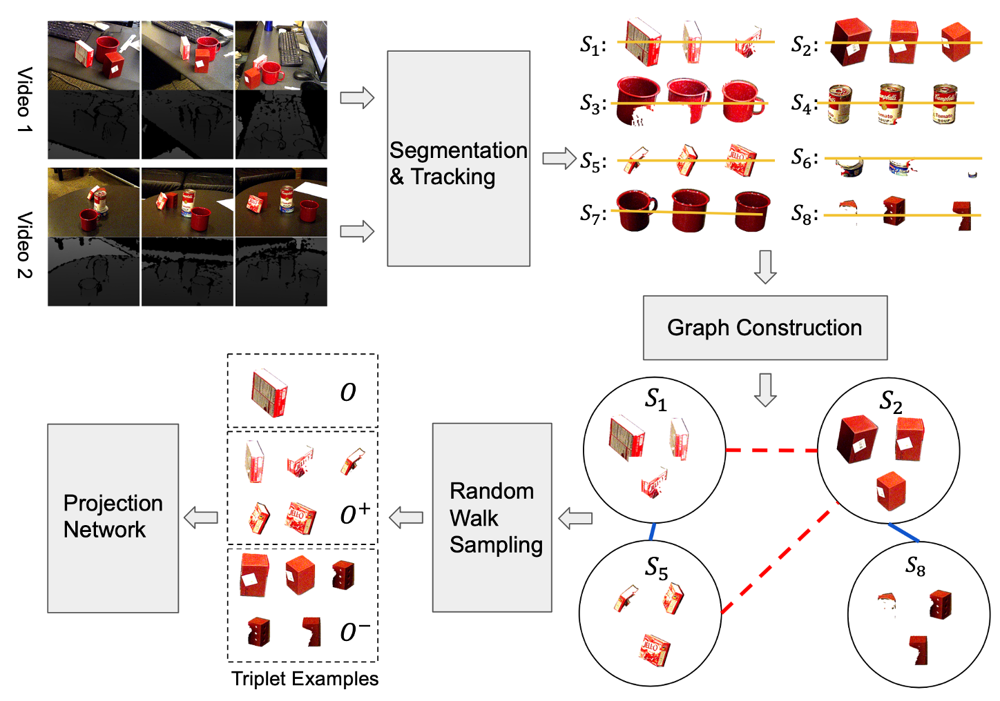

# A Self supervised Learning System for Object Detection in Videos Using Random Walks on Graphs
This is the official webpage for our paper "A Self supervised Learning System for Object Detection in Videos Using Random Walks on Graphs"
---
##Overall
This code is a pytorch implementation of the unsupervised object detection method introduced in our paper 
"A Self supervised Learning System for Object Detection in Videos Using Random Walks 
on Graphs".


### Paper: 
https://arxiv.org/abs/2011.05459\
### Video
[](https://www.youtube.com/watch?v=S_tCtSWX7tE "RWS")

## Requirements
- Python 3.7
- pytorch 1.5
- torchvision 0.6
- cuda 10

## Training and evaluation
We provide an example on CORe50 datasets: \
1. Download the datasets "cropped_128x128_images.zip" on https://vlomonaco.github.io/core50/index.html#download
2. Under the project root RWS/, run:
    ```
    source setup.sh
    ```
3. Under RWS/script/CORe50/data_processing/, provide data path in the data_processing.sh file. Then, run:
    ```
    sh data_processing.sh
    ```
4. Under RWS/script/CORe50/graph_construction/ run:
    ```
    sh build_graph.sh
    ```
    To visualize the similarity graph, run:
    ```
    python graph_viz
    ```
5. Under RWS/script/CORe50/train/, run:
    ```
    sh random_walk_sampling.sh
   ```
   Then, run:
   ```
   sh train.sh
    ```
6. To evaluate the trained projection layers, under RWS/script/CORe50/evaluate/ run:
    ```
   sh unsupervised_cluster.sh
   ```
## Reference
Is you find the method useful, please consider cite the paper:
```
@misc{tan2020selfsupervised,
      title={A Self-supervised Learning System for Object Detection in Videos Using Random Walks on Graphs}, 
      author={Juntao Tan and Changkyu Song and Abdeslam Boularias},
      year={2020},
      eprint={2011.05459},
      archivePrefix={arXiv},
      primaryClass={cs.CV}
}
```